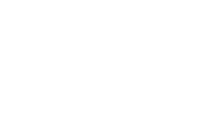

<!-- LOGO PRESENTATION -->
<section>

  

   

<!-- ACERCA DE ESTE PROYECTO -->
## 🚧 - Acerca de este proyecto
Este a sido un proyecto bastante curioso, ya que es y será para el grupo musical "CATARSIS".

## 🎯 - Lenguajes usados

## 📖 - Organización y Historial
* 1.0
    * Preparación en <b>bloc de notas<b/>

<!-- AGRADECIMIENTOS -->
## 🥇 - Agradecimientos
* <a href="https://chat.openai.com/">ChatGPT</a>

* <a href="https://www.figma.com/community/file/1175476688639242963/maquette-site-web-pour-le-groupe-de-musique-170-39">Idea de referenicia</a>

<!-- LINKS -->
## 🛠️ - Otros proyectos
* <a href="https://github.com/Sailok25/Rebootiga">Re:Bootiga</a>
* <a href="https://github.com/Sailok25/TRRG-FIT">TRRG-FIT</a>
